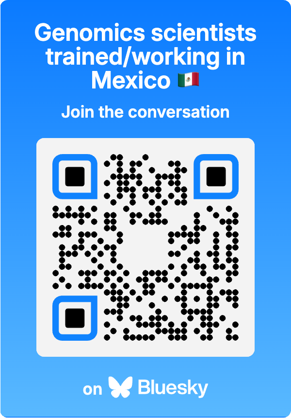

Hace poco dí un seminario remoto para el curso de _Aplicaciones de la Genómica_ organizado por [Esperanza Martínez Romero](https://www.ccg.unam.mx/maria-esperanza-martinez-romero/) y [Alejandra Zayas Del Moral](https://bsky.app/profile/alezayas.bsky.social). La idea era hablar sobre mi carrera y mostrar algunos trabajos de investigación recientes de mi equipo.

<blockquote class="bluesky-embed" data-bluesky-uri="at://did:plc:h7p2smbyfobkpcs7dbgvhmeh/app.bsky.feed.post/3laendxnqny22" data-bluesky-cid="bafyreih4kzmmr5v5bg2d2jg57rwqg67krxl3yg6kahgp5ndrvhhazoi6iu">
A week ago I had the privilege to present to #LCG-UNAM students as part of the Aplicaciones de la Genómica course by Esperanza Martínez and @alezayas.bsky.social

www.youtube.com/watch?v=a_Ip... (in Spanish 🇲🇽)
🛝 speakerdeck.com/lcolladotor/...

#DeconvoBuddies @bioconductor.bsky.social #RStats  <a href="https://bsky.app/profile/did:plc:h7p2smbyfobkpcs7dbgvhmeh/post/3laendxnqny22?ref_src=embed">[image or embed]</a>
&mdash; 🇲🇽 Leonardo Collado-Torres (<a href="https://bsky.app/profile/did:plc:h7p2smbyfobkpcs7dbgvhmeh?ref_src=embed">@lcolladotor.bsky.social</a>) <a href="https://bsky.app/profile/did:plc:h7p2smbyfobkpcs7dbgvhmeh/post/3laendxnqny22?ref_src=embed">November 7, 2024 at 11:07 AM</a></blockquote>

Pero también quería tomarme el tiempo para hablar sobre la importancia de construir comunidad y de pedir apoyo de sus comunidades conforme vayan avanzando en sus carreras. Soy egresado de la tercera generación de la Licenciatura en Ciencias Genómicas de la Universidad Nacional Autónoma de México (LCG-UNAM). Me gradué en 2009 (ver [mi entrada sobre mi trayectoria](https://lcolladotor.github.io/2018/11/06/a-knot-of-threads-from-cshl-to-lcg-unam-to-aldo-barrientos-to-diversity-scholarship-opportunities/) para más detalles). Eso significa que no tuvimos tantas personas a las que seguir como ustedes tienen ahora. Aquí les dejo un extracto de cómo les transmití esto a los estudiantes al final de mi seminario.

<iframe width="560" height="315" src="https://www.youtube.com/embed/OVMw0k6AydA?si=-km8P5ei3SfBSeyC" title="YouTube video player" frameborder="0" allow="accelerometer; autoplay; clipboard-write; encrypted-media; gyroscope; picture-in-picture; web-share" referrerpolicy="strict-origin-when-cross-origin" allowfullscreen></iframe>

Nota que si no hablas español, YouTuve puede traducir automáticamente los subtítulos a tu idioma de tu preferencia ^^.

## La red LCG(EJ)-UNAM

Digamos que eres un estudiante y quieres conectarte con la red LCG(EJ)-UNAM. Bueno, la [red LCG-UNAM](https://www.lcg.unam.mx/) y [LCG-EJ-UNAM](https://lcgej.unam.mx/) en realidad no es tan fácil de encontrar 😔.

Nota que los dos programas de licenciatura hermanos en realidad son dirigidos por diferentes personas, ambas de la UNAM. Personalmente considero que son parte del mismo grupo (particularmente desde una perspectiva internacional) ya que creo que dividirlos no es útil. Aunque entiendo que cada programa tiene áreas específicas que quieren enfatizar, diferentes problemas de financiamiento y diferentes desafíos que enfrentan.

### Emails

Ok, tal vez una forma de conectarse con otros es a través de correo electrónico. Para LCG-UNAM hay una lista de correos para todos, pero eso solo incluye correos `@lcg.unam.mx` que muchos egresadxs no revisan/usan más. Para LCG-EJ-UNAM me han dicho que no hay una lista de correos.

Para cada generación en LCG-UNAM también hay otra lista de correos, pero bueno, tienen el mismo problema de solo incluir correos `@lcg.unam.mx`.

Durante la preparación para las [celebraciones de LCG20](https://www.lcg.unam.mx/simposio-internacional-por-el-20-aniversario-del-programa-de-licenciatura-en-ciencias-genomicas-lcg-unam/) (20 aniversario de LCG-UNAM), se compartió una hoja de cálculo de Google donde la gente escribió su nombre, generación y correo electrónico. Así que también he usado esa lista de correos (muchos de los cuales son cuentas `@gmail.com`). Hay 130 correos listados ahí (¡algunos con errores tipográficos!).

### Facebook

Egresadxs de LCG-UNAM crearon un [grupo privado de Facebook](https://www.facebook.com/groups/21720863576). Actualmente tiene 355 miembrxs. Veo que algunos miembrxs son egresadxs de LCG-EJ-UNAM, así que creo que ambos programas son bienvenidos ahí. Este es probablemente el recurso que más gente usa cuando intenta pedir ayuda o compartir oportunidades. Sin embargo, muchas personas ya no usan Facebook, así que me pregunto cuántos de lxs miembrxs están realmente activxs. Tiene el beneficio de ser un grupo privado, a diferencia de otras plataformas de redes sociales. Así que creo que este grupo de Facebook seguirá siendo una de las principales formas de ponerse en contacto con lxs egresadxs de LCG(EJ)-UNAM.

### Slack

Como tal vez ya sabrás, [soy un gran fan de Slack para comunicarme en el trabajo](https://lcolladotor.github.io/2018/06/19/using-slack-for-academic-departmental-communication/). Sin embargo, hasta donde sé, no hay un espacio de trabajo de Slack para LCG(EJ)-UNAM. Sin embargo, como cofundador de la [Comunidad de Desarrolladores de Software en Bioinformática](https://comunidadbioinfo.github.io/), he estado animando a la gente a unirse al [espacio de trabajo de Slack de la CDSB](https://join.slack.com/t/comunidadbioinfo/shared_invite/zt-8lsvpm84-Fne1W0hadk6cpjgJS17Tnw).

Una forma en que lo hago es pidiendo a lxs estudiantes de los cursos LCG y LCG-EJ que he impartido que se unan al Slack de la CDSB, donde configuro un canal para el curso y me comunico con ellxs a través de él. Entonces, una vez que el curso ha terminado, son parte del Slack de la CDSB y pueden establecer contactos con otrxs allí. Este espacio de trabajo de Slack no es tan activo como me gustaría, pero bueno, es un comienzo. Actualmente tiene 396 miembrxs en el canal `#general`.

### X/Twitter y ahora Bluesky

Durante mis cursos también he animado a lxs estudiantes a crear una cuenta de Twitter para poder conectarse con otrxs científicxs en general, darse a conocer y conocer a personas que puedan ayudarlxs en el camino. Tal vez indirectamente, como compartiendo recursos interesantes. Tal vez directamente, haciéndose preguntas entre sí y luego posiblemente reuniéndose en persona más adelante. Algunos egresadxs de LCG-UNAM históricamente fueron muy activxs en Twitter.

## Bluesky ha despegado

Pero, X/Twitter no es lo que solía ser. En las últimas semanas, la alternativa de código abierto [Bluesky](https://bsky.app/) ha despegado. En 2023 tenías que obtener un código para unirte, lo que realmente hacía inviable que lxs estudiantes se unieran o la comunidad en general. Pero las cosas son diferentes ahora a finales de 2024 y Bluesky realmente ha despegado últimamente. Una de las razones son los paquetes de inicio, que permiten a cualquiera recomendar hasta 150 cuentas que otrxs podrían querer seguir.

Una razón personal por la que todavía estaba usando X/Twitter era porque sentía que mi comunidad de científicxs genómicxs entrenadxs en México, trabajando en México o ayudando a entrenar a mexicanxs no estaba representada en Bluesky. Aprecio que fui incluido en el ["RStats Starter Pack"](https://bsky.app/profile/jeremy-data.bsky.social/post/3l6x3gmsxqe2z) por [Jeremy Allen](https://bsky.app/profile/jeremy-data.bsky.social), lo que realmente ha ayudado con mi visibilidad. Como me gustaría hacer el cambio completo a Bluesky, estoy usando mi nueva visibilidad para tratar de animar a otrxs a hacer el cambio también.

## Genómicxs entrenadxs/trabajando en México 🇲🇽

Para tratar de implementar mis deseos, creé [un paquete de inicio de Bluesky](https://go.bsky.app/5bWBN5V). El nombre está limitado a 50 caracteres, pero bueno, quería hacerlo amplio en un sentido: cualquier persona que haya sido entrenada en México, trabaje en México (no necesita ser ciudadanx mexicanx) o haya ayudado a entrenar a mexicanxs dentro del dominio científico de la genómica.

Esta definición definitivamente incluye a miembrxs de LCG-UNAM y LCG-EJ-UNAM, pero también a lxs egresadxs de los talleres de la CDSB, [RMB](https://www.redmexicanadebioinformatica.org/), y [NNB-UNAM](https://www.nnb.unam.mx/). Además de científicxs que trabajan o están involucradxs con [CCG-UNAM](https://www.ccg.unam.mx/), [IBt-UNAM](https://www.ibt.unam.mx/), [LIIGH-UNAM](https://bsky.app/profile/liigh-unam.bsky.social), entre otras instituciones. Sí, la UNAM es muy prevalente en este momento por muchas razones, pero una de ellas es que fui entrenado en LCG-UNAM y por lo tanto sé más sobre esa red en este momento.

## Logrando que se unan a Bluesky

Al principio encontré cerca de 30 cuentas de Bluesky para el paquete de inicio. La mayoría de ellas ya las conocía, ya que habíamos estado compartiendo códigos de Bluesky a través de WhatsApp y otros medios en 2023 para tratar de que la gente se uniera a Bluesky. Para obtener más, escribí sobre el paquete de inicio a la lista de correo `@lcg.unam.mx`, la lista de 130 correos de exalumnxs de LCG, así como publiqué sobre ello en Facebook, X/Twitter, CDSB Slack y LinkedIn. Y, por supuesto, en Bluesky.

Pero sé que un mensaje masivo como ese solo va a llamar la atención de pocas personas. Así que apliqué algo que aprendí de [Alejandro Reyes](https://bsky.app/profile/areyesq.bsky.social) mientras trabajabamos juntos en los primeros años de la existencia de la CDSB. Es decir, contactar a las personas directamente.

Contacté a 147 cuentas de X a través de mensajes directos y 9 a través de publicaciones públicas de cuentas a las que sigo en X/Twitter. También envié un correo electrónico a todas las organizadoras de [RLadiesMX](https://rladiesmx.netlify.app/en/) ya que creo que sería genial que también se unieran a Bluesky. También necesito contactar a las comunidades listadas en mi [sitio web del curso de Computación Estadística de JHU](https://lcolladotor.github.io/jhustatcomputing/posts/25-python-for-r-users/#community). También envié mensajes de texto a algunas a través de WhatsApp ya que tienen cuentas de Bluesky que están inactivas, y por lo tanto no puedo agregarlas al paquete de inicio.

Yo estimo que entre un tercio y la mitad han respondido hasta ahora. Muchas personas preguntan: _¿Qué es Bluesky?_. Otras habían oído hablar de ello pero no tenían un código de invitación para unirse en 2023 y no sabían que ya no necesitaban un código. Otras dudan en crear una cuenta en una nueva plataforma de redes sociales. Pero la mayoría están entusiasmadas por unirse y poco después han creado su cuenta de Bluesky (¡algunas incluso ya tenían una que no había encontrado!).

Actualmente tenemos 77 cuentas listadas en el paquete de inicio de un máximo de 150. Probablemente tendré que hacer un paquete de inicio parte 2, o tal vez incluso una parte 3 más adelante. Pero bueno, estoy emocionado de ver más de nosotrxs unirnos a Bluesky. Después de todo, quiero que nuestras voces sean escuchadas y es difícil hacerlo si no estamos en la conversación desde el principio.

Solo un fin de semana de tiempo puede hacer una gran diferencia en la construcción de la comunidad. Pero bueno, una vez que logras que la pelota se mueva un poco, depende de la comunidad que siga moviendose. Estoy emocionado de ver a dónde va esto y cómo podemos ayudarnos mutuamente en el futuro 🙌🏽 🇲🇽 🧬 ^_^.

